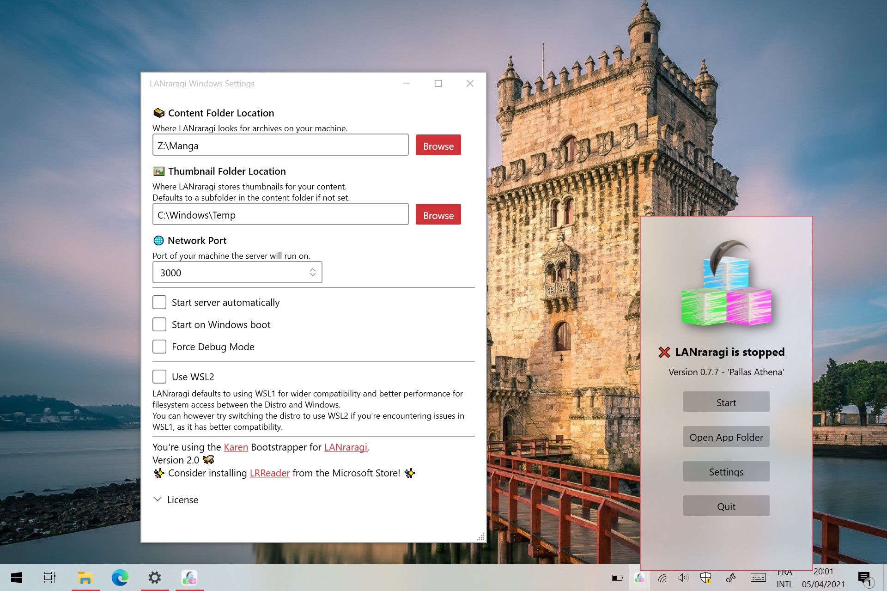
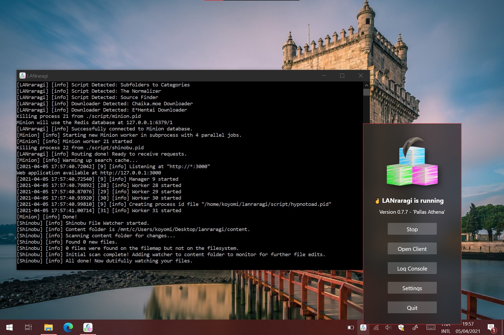

# 🪟 LRR for Windows (Win10)

## Download a Release

You can directly install LANraragi from the [Microsoft Store](https://cutt.ly/9TJIMC6). This will install the latest release.  

[](https://cutt.ly/9TJIMC6)  

ms-windows-store://pdp/?productid=XP9K4NMNPDMH6L  


As an alternative, you can always download the latest Windows MSI Installer on the [Release Page](https://github.com/Difegue/LANraragi/releases).


Windows Nightlies are available [here](https://nightly.link/Difegue/LANraragi/workflows/push-continous-delivery/dev).


## Installation

Simply execute the installer package. (The MS Store will do this for you if you went that way)

You might get a SmartScreen prompt from Windows (doesn't seem to happen with the Store) as the installer isn't signed; These are perfectly normal.  
(If you're wondering why I don't sign installers, [this](https://gaby.dev/posts/code-signing) article is a good read.)


MS Store installs will be installed to the default location. If you don't want the app to install in _%AppData%_, consider downloading the installer and running it manually.




The installer will tell you about this anyways, but LRR for Windows **requires** the Windows Subsystem for Linux to function properly.  
Read the tutorial [here](https://docs.microsoft.com/en-us/windows/wsl/install) to see how to enable WSL on your Windows 10 machine.

You don't need to install a distribution through the Windows Store, as that is handled by the LRR installer package.


Once the install completes properly, you'll be able to launch the GUI from the shortcut in your Start Menu:


## Configuration

Starting the GUI for the first time will prompt you to setup your content folder and the port you want the server to listen on. The main GUI is always available from your Taskbar.



You can also decide whether to start the GUI alongside Windows, or start LRR alongside the GUI. Combining the two makes it so that LANraragi starts alongside Windows. 🔥🔥🔥


On Windows, VeraCrypt encrypted drives are known to not work properly as the content folder. See [https://github.com/Difegue/LANraragi/issues/182](https://github.com/Difegue/LANraragi/issues/182) for details.


## Usage



Once the program is running, you can open the Web Client through the shortcut button on the user interface. You can also toggle the Log Console on/off to see what's going on behind the scenes.

## Updating

Updates have to be done manually by downloading and running the latest installer.  
If you're using the MS Store, you can also update through it -- Keep in mind releases take usually a day or so to land on the store compared to direct downloads off GitHub.

## Uninstallation

Simply uninstall the app from Windows Settings.  
Presto! Your database is not deleted in case you ever fancy coming back.

## Troubleshooting

### Installer failures

If the installer fails, it's likely because it can't enable the Windows Subsystem for Linux (WSL) on your machine. Try running through the official Microsoft installation guide depicted [here](https://docs.microsoft.com/en-us/windows/wsl/install-win10).

If WSL is installed properly but the tray GUI reports LANraragi as not being installed, try using the `wslconfig.exe /l` command and make sure the "lanraragi" distribution is present.


The tray GUI will show the error message it encountered instead of the LRR Version number if it fails to detect the distro - This might help you troubleshoot further.

Some users reported that antivirus software can block the WSL distro install portion of the installer, so you might have some luck temporarily disabling it.

If you're still getting installer failures past that, try generating a full log of the installer:

```
msiexec /i "lanraragi.msi" /l*v "install.log"
```

and open a GitHub issue with it.

### Server isn't available on `localhost:3000` even though it has started properly

Running the application as Administrator might fix this in some instances.  
Otherwise, make sure the Windows Firewall isn't blocking any `perl` process.

WSL2 uses a different network stack and can help if all else fails, although enabling it will likely make the server unreachable from remote machines.
